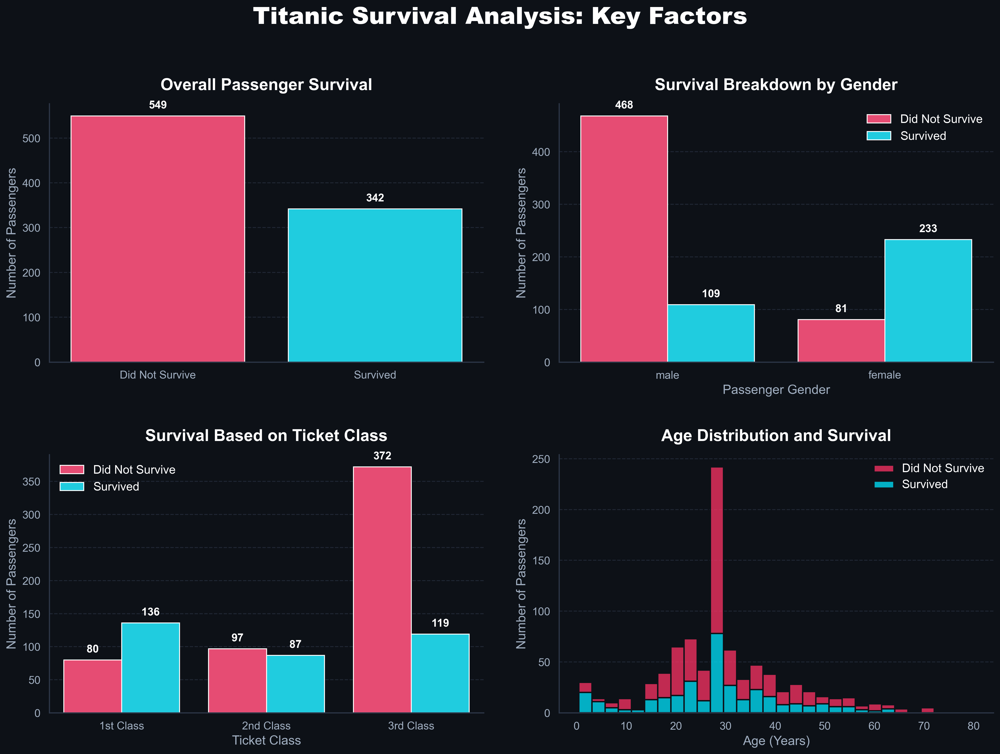

<div align="center">
  <h1>🚢 Titanic Dataset - Data Cleaning & EDA 📊</h1>
  <p><i>SkillCraft Technology Data Science Internship - Task 2 (SCT_DS_2)</i></p>
  
  
  
  
  
</div>

---

## 🎯 Task Objective

The goal of this task is to perform **Data Cleaning** and **Exploratory Data Analysis (EDA)** on the well-known Kaggle Titanic dataset. This project aims to uncover the underlying patterns, trends, and relationships between various passenger features (such as Age, Sex, and Ticket Class) and their survival outcomes.

## 🛠️ Data Cleaning Process

Raw datasets often contain missing values or highly granular data that needs to be addressed before analysis. The following preprocessing steps were executed:

- **Missing Age Imputation**: Missing values in the `Age` column were replaced with the median age. This ensures the data distribution isn't skewed by outliers.
- **Missing Port Imputation**: Missing values in the `Embarked` column were replaced with the most frequent value (the mode).
- **Feature Pruning**: High-cardinality or incomplete features such as `Cabin` (excessive missing data), `Ticket`, and `Name` were dropped to focus on foundational EDA.

## 📈 Exploratory Data Analysis (EDA)

The core analysis is condensed into a comprehensive **2x2 Visual Dashboard** generated via Python (`seaborn` and `matplotlib`). 

### Key Dashboard Insights:
1. **Survival Baseline**: The overall count plot indicates that a significant majority of passengers did not survive.
2. **Survival by Sex**: Female passengers exhibited a vastly higher survival rate compared to male passengers.
3. **Survival by Class**: First-class (`Pclass=1`) passengers had a distinct survival advantage over second and third-class passengers.
4. **Age Demographics**: A stacked histogram highlights that younger demographics (particularly children) had higher survival proportions, while a massive block of adults in the 20-30 age range comprised the largest casualty group.

<div align="center">
  <h3>Generated Dashboard</h3>
  
</div>

## 🚀 How to Run the Project

Follow these steps to replicate the data cleaning process and generate the visualization dashboard locally:

**1. Clone the repository and navigate to the project directory:**
```bash
# Navigate to the workspace (assuming you are in the root directory)
cd SC_DS_2
```

**2. Ensure dependencies are installed:**
```bash
pip install pandas seaborn matplotlib
```

**3. Run the analysis script:**
```bash
python task2.py
```

Upon successful execution, the script will output the visualizations directly to a file named `titanic_eda_dashboard.png` in your current directory.

---
*Completed as part of the SkillCraft Technology Data Science Internship.*
